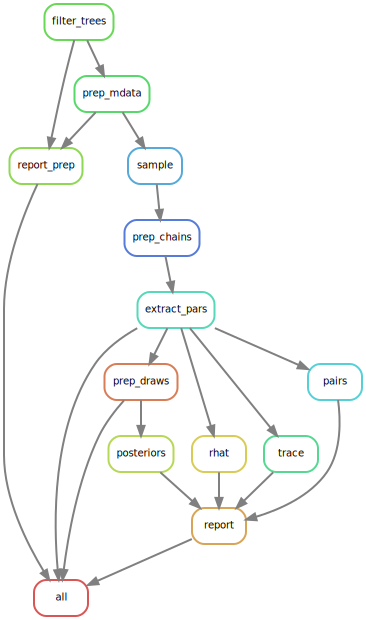

```{r setup, include=FALSE}
rm(list = ls()) ; invisible(gc()) ; set.seed(42)
library(knitr)
library(tidyverse)
theme_set(bayesplot::theme_default())
opts_chunk$set(echo = F, message = F, warning = F, fig.height = 6, fig.width = 8,
               cache = F, cache.lazy = F)
```

[`singularity` & `snakemake`](https://github.com/sylvainschmitt/snakemake_singularity) workflow to infer growth from Guyafor data.

```{r dag, fig.cap="Workflow."}

```

# Installation

- [x] Python ≥3.5
- [x] Snakemake ≥5.24.1
- [x] Golang ≥1.15.2
- [x] Singularity ≥3.7.3
- [x] This workflow

```{bash, eval=F, echo=T}
# Python
sudo apt-get install python3.5
# Snakemake
sudo apt install snakemake`
# Golang
export VERSION=1.15.8 OS=linux ARCH=amd64  # change this as you need
wget -O /tmp/go${VERSION}.${OS}-${ARCH}.tar.gz https://dl.google.com/go/go${VERSION}.${OS}-${ARCH}.tar.gz && \
sudo tar -C /usr/local -xzf /tmp/go${VERSION}.${OS}-${ARCH}.tar.gz
echo 'export GOPATH=${HOME}/go' >> ~/.bashrc && \
echo 'export PATH=/usr/local/go/bin:${PATH}:${GOPATH}/bin' >> ~/.bashrc && \
source ~/.bashrc
# Singularity
mkdir -p ${GOPATH}/src/github.com/sylabs && \
  cd ${GOPATH}/src/github.com/sylabs && \
  git clone https://github.com/sylabs/singularity.git && \
  cd singularity
git checkout v3.7.3
cd ${GOPATH}/src/github.com/sylabs/singularity && \
  ./mconfig && \
  cd ./builddir && \
  make && \
  sudo make install
# detect Mutations
git clone git@github.com:sylvainschmitt/inferGrowth.git
cd inferGrowth.git
```

# Usage

## Locally

```{bash, eval=F, echo=T}
snakemake -s Prepare -np
snakemake -s Prepare -j 4
snakemake -np -j 4 --resources mem_mb=10000 # dry run
snakemake --dag | dot -Tsvg > dag/dag.svg # dag
snakemake --use-singularity -j 4 --resources mem_mb=10000 # run
```

## HPC

```{bash, eval=F, echo=T}
module load bioinfo/snakemake-5.25.0 # for test on node
snakemake -np # dry run
sbatch job.sh # run
snakemake --dag | dot -Tsvg > dag/dag.svg # dag
```

# Images

* **singularity-r-bioinfo**:
    * url: https://github.com/sylvainschmitt/singularity-r-bioinfo
    * adress: https://github.com/sylvainschmitt/singularity-r-bioinfo/releases/download/0.0.3/sylvainschmitt-singularity-r-bioinfo.latest.sif
    * rules: filter_trees, prep_mdata, extract_pars, prep_draws
    * packages used: tidyverse, vroom
* **singularity-r-bioinfo**:
    * url: https://github.com/JBris/stan-cmdstanr-docker
    * adress: docker://ghcr.io/jbris/stan-cmdstanr-docker:latest
    * rules: prep_chains, rhat
    * packages used: tidyverse, vroom, cmdstanr, posterior
* **lacking**:
    * singularity-r-bioinfo?
    * rules: report_prep, report, pairs, trace
    * packages used: knitr, rmarkdown, viridis, bayesplot, GGally

# Workflow

## Prepare

*Prepare inference.*

### [filter_trees](https://github.com/sylvainschmitt/inferGrowth/blob/hetre/rules/filter_trees.smk)

* Script: [`filter_trees.R`](https://github.com/sylvainschmitt/inferGrowth/blob/hetre/scripts/filter_trees.R)

### [prep_mdata](https://github.com/sylvainschmitt/inferGrowth/blob/hetre/rules/prep_mdata.smk)

* Script: [`prep_mdata.R`](https://github.com/sylvainschmitt/inferGrowth/blob/hetre/scripts/prep_mdata.R)

### [report_prep](https://github.com/sylvainschmitt/inferGrowth/blob/hetre/rules/report_prep.smk)

* Script: [`report_prep.R`](https://github.com/sylvainschmitt/inferGrowth/blob/hetre/scripts/report_prep.R)

## Run

*Run inference.*

### [sample](https://github.com/sylvainschmitt/inferGrowth/blob/hetre/rules/sample.smk)

* Script: [`sample.R`](https://github.com/sylvainschmitt/inferGrowth/blob/hetre/scripts/sample.R)

### [prep_chains](https://github.com/sylvainschmitt/inferGrowth/blob/hetre/rules/prep_chains.smk)

* Script: [`prep_chains.R`](https://github.com/sylvainschmitt/inferGrowth/blob/hetre/scripts/prep_chains.R)

### [extract_pars](https://github.com/sylvainschmitt/inferGrowth/blob/hetre/rules/extract_pars.smk)

* Script: [`extract_pars.R`](https://github.com/sylvainschmitt/inferGrowth/blob/hetre/scripts/extract_pars.R)

### [prep_draws](https://github.com/sylvainschmitt/inferGrowth/blob/hetre/rules/prep_draws.smk)

* Script: [`prep_draws.R`](https://github.com/sylvainschmitt/inferGrowth/blob/hetre/scripts/prep_draws.R)


## Post

*Inference post-analyses.*

### [rhat](https://github.com/sylvainschmitt/inferGrowth/blob/hetre/rules/rhat.smk)

* Script: [`rhat.R`](https://github.com/sylvainschmitt/inferGrowth/blob/hetre/scripts/rhat.R)

### [trace](https://github.com/sylvainschmitt/inferGrowth/blob/hetre/rules/trace.smk)

* Script: [`trace.R`](https://github.com/sylvainschmitt/inferGrowth/blob/hetre/scripts/trace.R)

### [pairs](https://github.com/sylvainschmitt/inferGrowth/blob/hetre/rules/pairs.smk)

* Script: [`pairs.R`](https://github.com/sylvainschmitt/inferGrowth/blob/hetre/scripts/pairs.R)

### [posteriors](https://github.com/sylvainschmitt/inferGrowth/blob/hetre/rules/posteriors.smk)

* Script: [`posteriors.R`](https://github.com/sylvainschmitt/inferGrowth/blob/hetre/scripts/posteriors.R)

### [report](https://github.com/sylvainschmitt/inferGrowth/blob/hetre/rules/report.smk)

* Script: [`report.R`](https://github.com/sylvainschmitt/inferGrowth/blob/hetre/scripts/report.R)
